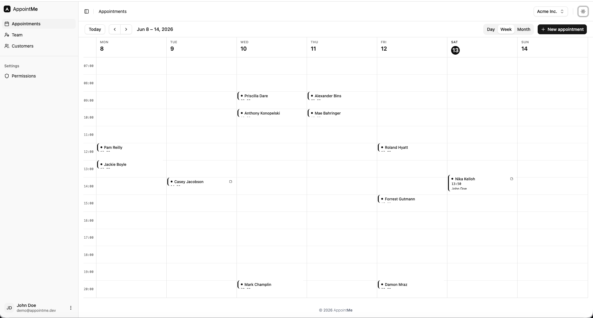
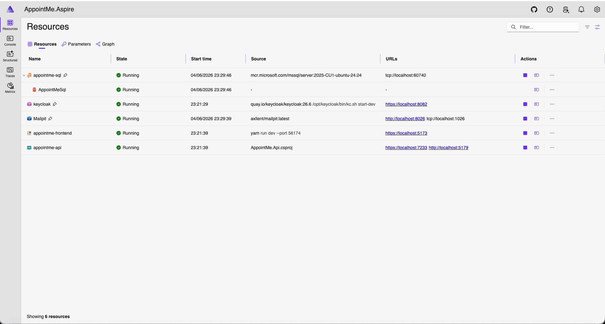

# AppointMe

A production-grade **modular-monolith .NET 10 SaaS foundation** for advanced .NET teams, solo founders, and agencies who want a real base.

AppointMe is a modular monolith (.NET 10 + React 19) with the hard parts already solved: multi-tenancy, authentication, authorization, CQRS, domain events, durable messaging, and a typed frontend wired to the backend contract. Clone it, press F5, and you have a running multi-tenant app — then build your product on top.

## Live demo

Try the **[live demo](https://app.appointme.dev/api/v1/login/demo)** — seeded multi-tenant instance, no signup required.

It's a shared public demo seeded with sample data — other visitors' activity may be visible, and the environment may be reset periodically.



## What's inside

- **Modular monolith** — Identity, Organizations, CRM, and Booking, each a bounded context with its own `DbContext` and schema, organized by vertical slice.
- **Auth done properly** — OIDC with a hybrid scheme: JWT Bearer for the API, cookies for browser flows. Keycloak for local development, Entra External ID for the Azure deployment — swappable behind the app's own provisioning flow. Sign-up, email verification, and password reset included.
- **Multi-tenancy** — company resolution via header/claim with EF Core query filters on a command path, raw Dapper reads carry the tenant predicate by convention.
- **CQRS + DDD** — writes through EF Core aggregates and domain events; reads through Dapper. Async messaging via Wolverine with a durable SQL transport.
- **Permission system** — auto-discovered, role-based permissions with default grant policies and conflic resolutions strategies.
- **Typed frontend** — React 19 + Vite 7 + Tailwind 4, TanStack Query hooks and TypeScript types generated directly from the backend OpenAPI spec (orval).
- **One-command local stack** — .NET Aspire orchestrates SQL Server, Keycloak, Mailpit, the API, and the frontend, with database migrations applied and demo data seeded automatically. Prefer to skip Aspire? A matching `compose.yaml` runs the same backing services so you can launch the API and frontend yourself.

## Quick start

Goal: clone the repo and have AppointMe running locally — backend, frontend, database, auth, and mail.

You choose how the backing services (SQL Server, Keycloak, Mailpit) run:

- **Option A — .NET Aspire** *(recommended)*: one command starts everything, including the API and frontend. Zero manual wiring.
- **Option B — Docker Compose**: brings up only the backing services on the same ports; you run the API and frontend yourself. Pick this if you'd rather not depend on the Aspire host, or want the dependencies running independently of your debugger.

Both produce an identical running app — same images, ports, credentials, and seeded data. Do the [prerequisites](#prerequisites) once, then follow either option.

### Prerequisites

| Requirement | Why | Notes |
|---|---|---|
| [.NET 10 SDK](https://dotnet.microsoft.com/download/dotnet/10.0) | Builds and runs the API and the Aspire host | `dotnet --version` should report `10.x` |
| [Docker](https://www.docker.com/products/docker-desktop/) (running) | Hosts SQL Server, Keycloak, and Mailpit containers | Docker Desktop or any OCI-compatible runtime |
| [Node.js 22+](https://nodejs.org/) & [Yarn](https://yarnpkg.com/) | Builds and serves the React frontend | `corepack enable` gives you Yarn |
| HTTPS dev certificate | Frontend and services run over HTTPS | `dotnet dev-certs https --trust` |

> First run pulls container images and restores NuGet/Yarn packages, so it takes a few minutes. Subsequent runs are fast — the SQL Server, Keycloak, and Mailpit containers are persistent and reused across restarts.

### Clone and trust the dev cert

Both options start here:

```bash
git clone <your-fork-or-clone-url> appointme
cd appointme

# One-time: trust the local HTTPS dev cert (used by the API, frontend, and Keycloak)
dotnet dev-certs https --trust
```

### Option A — .NET Aspire

```bash
# Start the whole stack — backing services, API, and frontend
cd src/AppointMe.Aspire
dotnet run
```

**Prefer your IDE?** Open `AppointMe.sln` in Visual Studio or Rider, set **`AppointMe.Aspire`** as the startup project, and press **F5**. That's the entire setup.

Either way, the [.NET Aspire dashboard](https://learn.microsoft.com/dotnet/aspire/fundamentals/dashboard/overview) opens automatically. Wait for every resource to turn **Running** (green) — the API waits for SQL Server and Keycloak to be healthy before it starts.



What happens on startup, with no action from you:

- SQL Server, Keycloak, and Mailpit containers come up.
- The `appointme` Keycloak realm (clients, roles, mappers) is imported.
- EF Core migrations are applied to every module's schema.
- Demo customers and appointments are seeded (Development only).
- The API starts, then the Vite frontend.

### Option B — Docker Compose

Compose runs only the backing services (SQL Server, Keycloak, Mailpit) — on the same ports, images, and credentials as Aspire. You run the API and frontend yourself.

```bash
# 1. One-time: export the trusted dev cert that Keycloak serves on https://localhost:8082
./docker/keycloak/export-dev-cert.sh
#    (Windows / no bash — run the command the script wraps:)
#    dotnet dev-certs https --format PEM --no-password -ep docker/keycloak/certs/keycloak.crt

# 2. Start the backing services and wait for them to report healthy
docker compose up -d
docker compose ps          # SQL Server and Keycloak should show "healthy"

# 3. Run the API (applies migrations + seeds demo data on first start)
dotnet run --project src/AppointMe.Api

# 4. In a second terminal, run the frontend
cd src/AppointMe.Frontend
yarn install
yarn dev
```

Then open **https://localhost:5173**. To stop the services, `docker compose stop` (keeps data) or `docker compose down` (removes the containers; SQL Server and Keycloak data survive in named volumes — add `-v` to wipe them too).

What Compose does for you:

- SQL Server, Keycloak, and Mailpit containers come up with health checks.
- Keycloak serves HTTPS on `8082` using your trusted dev cert and imports the `appointme` realm.
- SQL Server and Keycloak data persist in named volumes across restarts.

EF Core migrations and demo-data seeding happen when **you** start the API in step 3 (same as Aspire — the API does this on startup, not Compose).

### Where everything lives

| Service | URL | Credentials |
|---|---|---|
| **Frontend (the app)** | https://localhost:5173 | sign up — see below |
| Aspire dashboard | shown in the console at startup | — |
| Keycloak admin console | https://localhost:8082 | `admin` / `admin` |
| Mailpit (catches all outgoing email) | http://localhost:8026 | — |
| API OpenAPI document | https://localhost:7233/openapi/v1.json | — |
| SQL Server | `localhost:60740` | `sa` / `Password1` |

> **About these credentials.** Every secret used in local development — the SQL `sa` password, the Keycloak `admin` account, and the Keycloak client secrets in `appsettings.Development.json` and `appointme-realm.json` — is a throwaway default. It only protects containers running on your machine, and it's committed on purpose so the stack runs with zero setup. These are safe to keep in a public repo, but **never reuse them in a real deployment**. Production secrets live in Azure Key Vault and are injected at deploy time — see [`infra/`](./infra). A `gitleaks` workflow scans every push/PR to catch any *real* secret that slips in.

### Create your first account

The app manages its own sign-up — you don't register through Keycloak directly.

1. Open **https://localhost:5173** and go to **Sign up** (`/auth/signup`).
2. Submit the form. AppointMe provisions your user in Keycloak and sends a verification email.
3. Open **Mailpit at http://localhost:8026**, find the verification email, and click the link. (No real mail is sent — Mailpit catches everything locally.)
4. Log in with your new credentials.
5. Complete **onboarding** to create your company. You now have a fully working, multi-tenant AppointMe instance with demo data to explore.

That's it — you're up and running.

## Project layout

```
src/
├── AppointMe.Aspire/        # .NET Aspire orchestrator — the F5 entry point for local dev
├── AppointMe.Api/           # ASP.NET Core API host (endpoints auto-discovered)
├── AppointMe.Shared/        # Shared domain abstractions, value objects, infrastructure
├── Identity/                # Authentication & user provisioning (Keycloak, Entra)
├── Organizations/           # Companies, employees, invitations, onboarding
├── CRM/                     # Customer management
├── Booking/                 # Appointments & scheduling
└── AppointMe.Frontend/      # React + Vite + TypeScript SPA
```

The codebase follows Domain-Driven Design with **vertical slice architecture** — each use case owns its command, handler, endpoint, and request/response in a single folder. For the full architecture guide, conventions, and patterns, see [`CLAUDE.md`](./CLAUDE.md).

## Common commands

```bash
# Full stack (recommended) — from src/AppointMe.Aspire
dotnet run

# Backing services only, without Aspire (see Quick start → Option B)
docker compose up -d        # start SQL Server, Keycloak, Mailpit
docker compose ps           # check health
docker compose down         # stop and remove containers (data volumes persist)

# Backend only
dotnet build AppointMe.sln
dotnet run --project src/AppointMe.Api

# Tests
dotnet test                                          # everything
dotnet test --filter "FullyQualifiedName~TestName"   # a single test

# Frontend — from src/AppointMe.Frontend
yarn install
yarn dev            # dev server on https://localhost:5173
yarn build          # production build
yarn lint           # ESLint
yarn generate:api   # regenerate the typed API client from the backend OpenAPI spec
```

> When you change the backend contract (endpoints, request/response shapes, routes, or auth attributes), restart the API and run `yarn generate:api` to keep the frontend's typed client in sync.

## Tech stack

- **Backend:** .NET 10, C# 14, EF Core 10, Wolverine 5.9, Dapper
- **Frontend:** React 19, TypeScript 5.8, Vite 7, Tailwind CSS 4, TanStack Query
- **Infrastructure:** SQL Server 2022/2025, Keycloak, orchestrated with .NET Aspire

## License

AppointMe is released under the [MIT License](./LICENSE) — free to use, modify, and
distribute, including commercially.

It builds on open-source libraries that remain under their own licenses. See
[`THIRD-PARTY-NOTICES.md`](./THIRD-PARTY-NOTICES.md) for attribution and a note on
Hangfire (LGPL-3.0).
